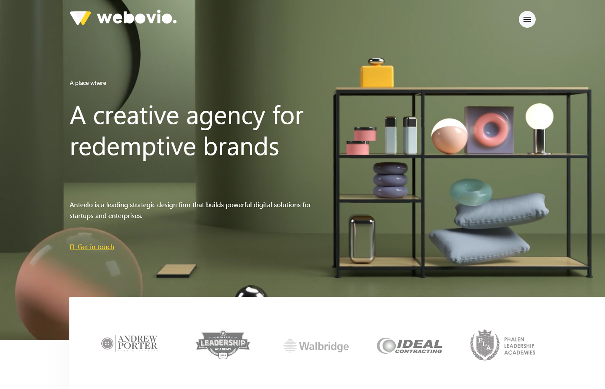

<h1 align="center">Webovio Landing Page</h1>

   A landing page for a design agency built from a free Adobe XD design template.

  <h3>
    <a href="https://interior-consultant-solution.netlify.app/">
      Live Demo
    </a>
     | 
    <a href="https://devchallenges.io/solutions/VRL9BZ9sRmehLdAHqVoX">
      Design (Adobe XD)
    </a>
  </h3>

<!-- TABLE OF CONTENTS -->

## Table of Contents

- [Table of Contents](#table-of-contents)
- [Overview](#overview)
  - [Project Requirements](#project-requirements)
    - [User stories](#user-stories)
  - [My Solution](#my-solution)
    - [Built With](#built-with)
    - [Development Tools & Libraries](#development-tools--libraries)
    - [Experience](#experience)
- [Useful Resouces](#useful-resouces)
- [Contact](#contact)

<!-- OVERVIEW -->

## Overview

### Project Requirements

Create a homepage following the given design. The page should be responsive. Fulfill user stories below

#### User stories

- User can see a page following the given design
- User can see a collapsed navigation
- When the user selects the hamburger menu, user can see the navigation

### My Solution

This is a simple landing page that can be built with HTML, CSS and a little bit of Javascript for the Navigation Menu. I decided to use this project to learn "more" about using a bundler to compile all source files into an optimized production build. By "more" I actually mean how to configure a bundler from scratch and more importantly create my own custom development/build workflow. As you may, or may not be aware, there are various options to choose from when it comes to bundlers. Since this is my first time working with a bundler (well configuring one from scratch to be precise), I chose <a href="https://en.bem.info/methodology/" target="_blank">Rollup.js</a> for it's ease-of-use (so I've heard) so that I can focus more on getting up to speed with the concepts of bundlers and how to quickly get started building a project without falling into the rabbit whole of config files.

Another feature is the use of the App Shell architechture to improve the initial page load time and make the landing page feel fast and more responsive. Yes may be a bit over-engineered, maybe too much but I just wanted to get more familiar with these technologies for future projects.

#### Built With

<!-- This section should list any major frameworks that you built your project using. Here are a few examples.-->

- Semantic <b>HTML</b> markup
- Custom <b>SCSS</b> properties to style the markup
- CSS <b>Flexbox</b> and <b>Media Queries</b> to create a mobile responsive layout
- <a href="https://en.bem.info/methodology/" target="_blank"><b>BEM</b></a> naming convention - useful for avoiding conflicting class names

#### Development Tools & Libraries

- <a href="https://rollupjs.org/" target="_blank">Rollup.js</a> to bundle source code into an optimized production build ready to be deployed
- A <a href="https://rollupjs.org/" target="_blank">PostCSS plugin for Rollup</a> along with <a href="https://rollupjs.org/" target="_blank">AutoPrefixer</a> to support SASS/SCSS compilation to cross-browser compatible CSS

#### Experience

This is project still in progess.

## Useful Resouces

- <a href="https://medium.com/free-code-camp/how-to-write-simple-modern-javascript-apps-with-webpack-and-progressive-web-techniques-a30354eab214">How to write simple modern javascript apps with webpack and progressive web techniques</a> - an article by Anurag Majumdar

## Contact

- LinkedIn - <a href="https://www.linkedin.com/in/tshepo-tsilo" target="_blank">https://www.linkedin.com/in/tshepo-tsilo</a>
